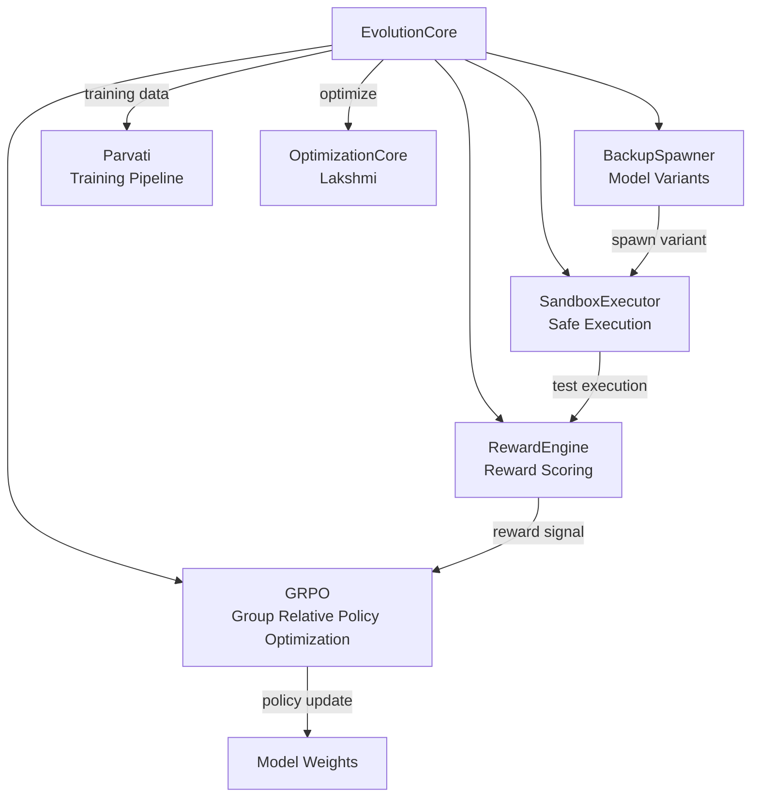
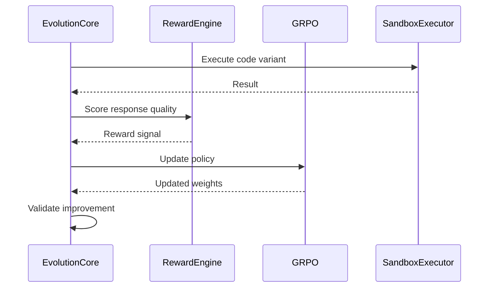

# EvolutionCore — Shiva (The Transformer)

The self-improvement engine. Destroys old patterns and transforms the system through reinforcement learning feedback.

## Architecture

## Components

| File | Purpose |
|------|---------|
| `EvolutionCore.py` | Main orchestrator for self-improvement cycles |
| `GRPO.py` | Group Relative Policy Optimization algorithm |
| `RewardEngine.py` | Scores response quality for RL feedback |
| `SandboxExecutor.py` | Safely executes code variants in isolation |
| `BackupSpawner.py` | Creates model weight variants for exploration |

## Evolution Cycle

