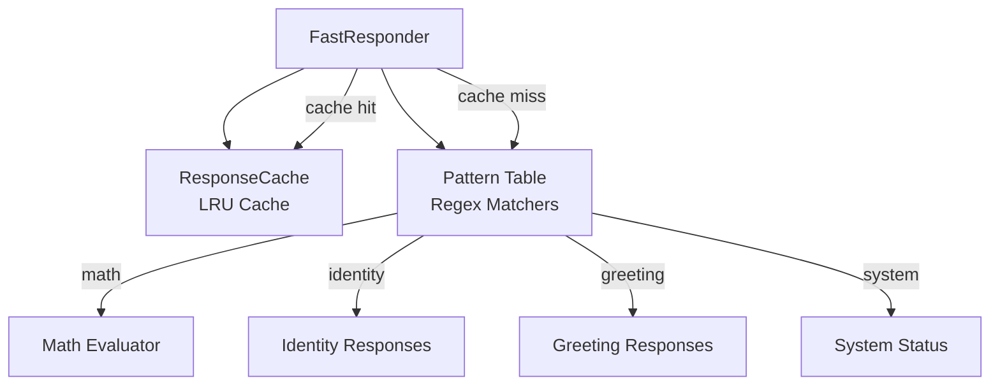
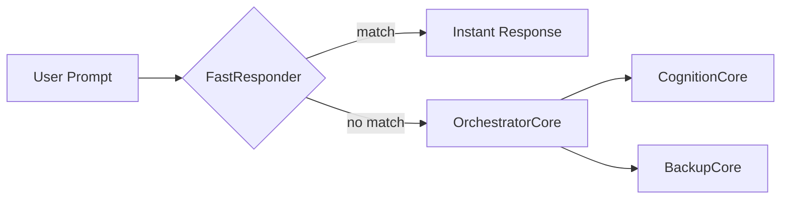

# FastResponder — Hanuman (Instant Answers)

Deterministic instant response engine. Handles math, identity, greetings, and known patterns in milliseconds with zero model loading.

## Architecture

## Pattern Categories

| Category | Examples | Response Time |
|----------|----------|---------------|
| Math | `128 * 8`, `sqrt 144`, `is 97 prime?` | <1ms |
| Identity | `who are you`, `what is vibhu oska` | <1ms |
| Greetings | `hello`, `hi`, `good morning` | <1ms |
| System | `help`, `status`, `version` | <1ms |

## Files

| File | Purpose |
|------|---------|
| `FastResponder.py` | Pattern matching engine + cache integration |
| `ResponseCache.py` | LRU cache for repeated queries |

## Integration

FastResponder is the **primary fast path**. OrchestratorCore attempts FastResponder first:

