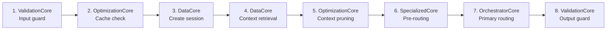
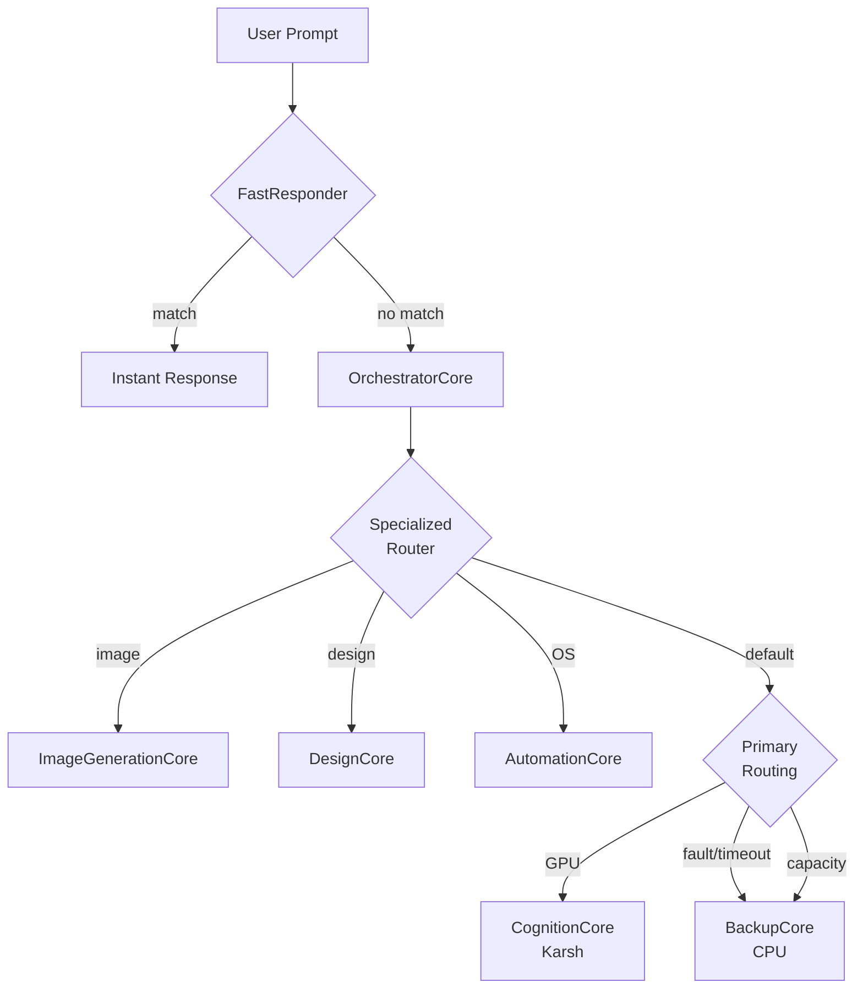

# OrchestratorCore — Brahma (The Creator)

The tactical request lifecycle manager. Absorbs HybridCore routing. Drives the 8-step processing pipeline without containing business logic.

## Responsibility

OrchestratorCore receives user input events from the ZeroMQ EventBus and drives the processing pipeline to completion. It routes requests, manages primary/backup handover, and coordinates all cores.

## The 8-Step Pipeline

## Routing Architecture (Absorbed from HybridCore)

## Specialized Core Pre-routing

Before reaching the primary routing path, the orchestrator runs a keyword classifier:

| Trigger keywords | Routed to |
|---|---|
| `generate image`, `draw`, `paint` | ImageGenerationCore |
| `design`, `layout`, `html` | DesignCore |
| `list files`, `run command`, `cpu usage` | AutomationCore |

## Contingency Protocol

| Trigger | Action |
|---------|--------|
| Primary fault | BackupCore takes over, status → DEGRADED |
| Primary timeout (60s) | BackupCore takes over, status → DEGRADED |
| Primary at capacity (2 concurrent) | BackupCore takes over, status stays HEALTHY |
| Explicit `backup-1` | Direct BackupCore handover |

## Key File

`OrchestratorCore.py` — Main orchestrator with absorbed routing logic
