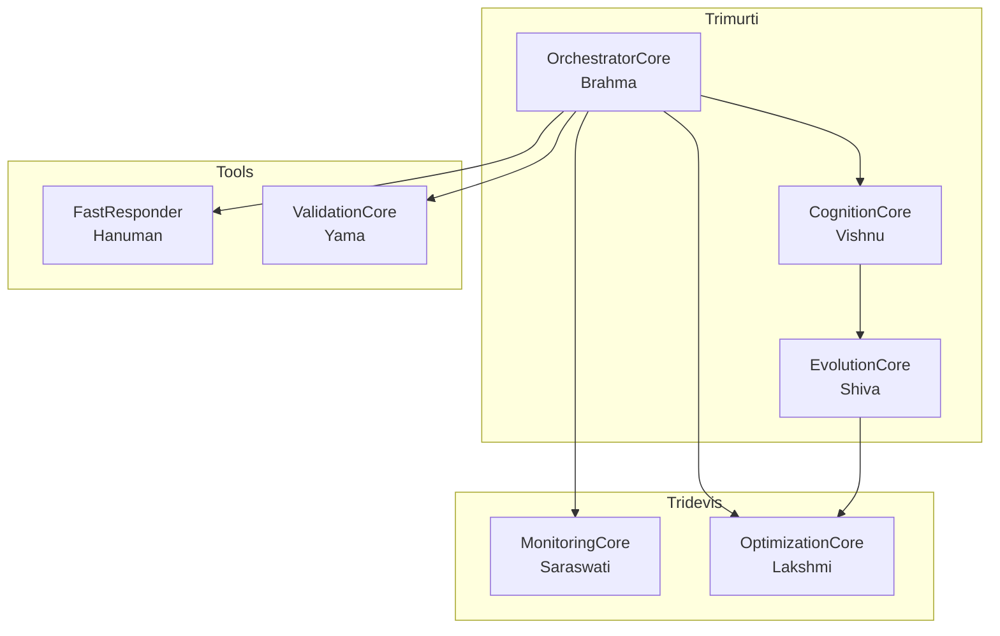

# MainCore — The Trimurti & Tools

The three supreme cores and their supporting tools. This is where all high-level reasoning, routing, and self-improvement happens.

## Trimurti (Three Supreme Cores)

| Core | Hindu Concept | Role |
|------|---------------|------|
| **OrchestratorCore** | Brahma (Creator) | Creates task flow, routes requests, coordinates pipeline |
| **CognitionCore** | Vishnu (Preserver) | Preserves knowledge, hosts Karsh LLM, generates responses |
| **EvolutionCore** | Shiva (Transformer) | Destroys old patterns, transforms through RL feedback |

## Tridevis (Shakti of Trimurti)

| Core | Hindu Concept | Role |
|------|---------------|------|
| **MonitoringCore** | Saraswati (Wisdom) | Observes, records telemetry, logs events |
| **OptimizationCore** | Lakshmi (Abundance) | Optimizes resources, caches responses, compresses context |
| **Training Pipeline** | Parvati (Power) | Feeds EvolutionCore with training data |

## Supporting Tools

| Tool | Hindu Concept | Role |
|------|---------------|------|
| **FastResponder** | Hanuman | Deterministic instant responses (math, identity, patterns) |
| **ValidationCore** | Yama | Input/output guard, sanitization, schema enforcement |

## Architecture

## Files

| File | Purpose |
|---|---|
| `OrchestratorCore/` | Brahma — request lifecycle, routing, pipeline coordination |
| `CognitionCore/` | Vishnu — Karsh LLM inference, quality gate |
| `EvolutionCore/` | Shiva — GRPO, reward engine, sandbox execution |
| `FastResponder/` | Hanuman — deterministic instant patterns |
| `ValidationCore/` | Yama — I/O contract enforcement |
| `MonitoringCore/` | Saraswati — telemetry, event logging |
| `OptimizationCore/` | Lakshmi — caching, context compression |
