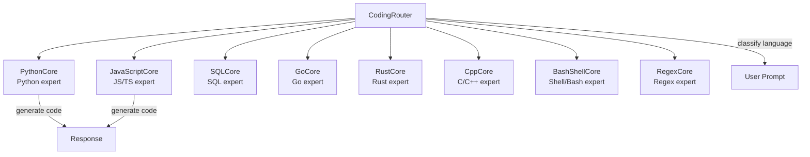

# CodingDomain — Code Specialists

9 language-specific specialists and a router for code generation, analysis, and refactoring tasks.

## Architecture

## Specialists

| Specialist | Language | Capabilities |
|------------|----------|--------------|
| `PythonCore` | Python | FastAPI, PyTorch, asyncio, dataclasses |
| `JavaScriptCore` | JS/TS | React, Node.js, WebSocket, ES6+ |
| `SQLCore` | SQL | SQLite, PostgreSQL, schema design |
| `GoCore` | Go | Goroutines, channels, HTTP servers |
| `RustCore` | Rust | Ownership, traits, async |
| `CppCore` | C/C++ | Templates, RAII, systems programming |
| `BashShellCore` | Shell | Bash, PowerShell, automation |
| `RegexCore` | Regex | Pattern matching, parsing |
| `CodingRouter` | — | Classifies prompt → specialist |
