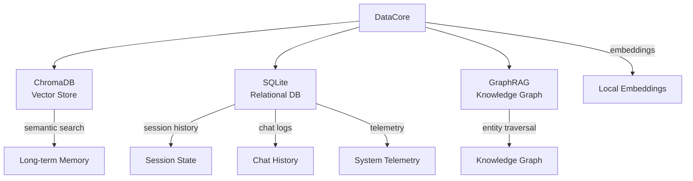

# DataCore — Memory Store

Dual memory system combining semantic vector search with relational state storage.

## Architecture

## Data Stores

| Store | Purpose | Backend |
|-------|---------|---------|
| ChromaDB | Semantic vector search | `vibhu_oska.db` (embedded) |
| SQLite | Relational state | `vibhu_oska.db` |
| Knowledge Graph | Entity relationships | SQLite `kg_nodes` + `kg_edges` |

## API

| Method | Purpose |
|--------|---------|
| `query_memory(prompt, top_k)` | Semantic search over long-term memories |
| `save_chat_message(...)` | Persist chat interaction |
| `get_session_history(session_id)` | Retrieve conversation history |
| `query_knowledge_graph(prompt)` | GraphRAG entity traversal |
| `create_session(session_id, user_id)` | Initialize new session |
