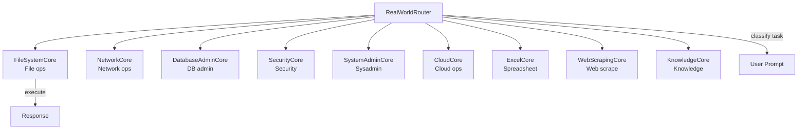

# RealWorldDomain — System Specialists

10 real-world system specialists and a router for OS, network, database, and security tasks.

## Architecture

## Specialists

| Specialist | Domain | Capabilities |
|------------|--------|--------------|
| `FileSystemCore` | Files | Read, write, list, search, permissions |
| `NetworkCore` | Network | HTTP, DNS, ping, port scanning |
| `DatabaseAdminCore` | Database | Schema design, queries, migrations |
| `SecurityCore` | Security | Auth, encryption, vulnerability scan |
| `SystemAdminCore` | Sysadmin | Process mgmt, services, cron |
| `CloudCore` | Cloud | AWS/GCP/Azure resource management |
| `ExcelCore` | Spreadsheet | CSV/Excel read/write, formulas |
| `WebScrapingCore` | Web | HTML parsing, data extraction |
| `KnowledgeCore` | Knowledge | Info retrieval, fact checking |
| `RealWorldRouter` | — | Classifies prompt → specialist |
