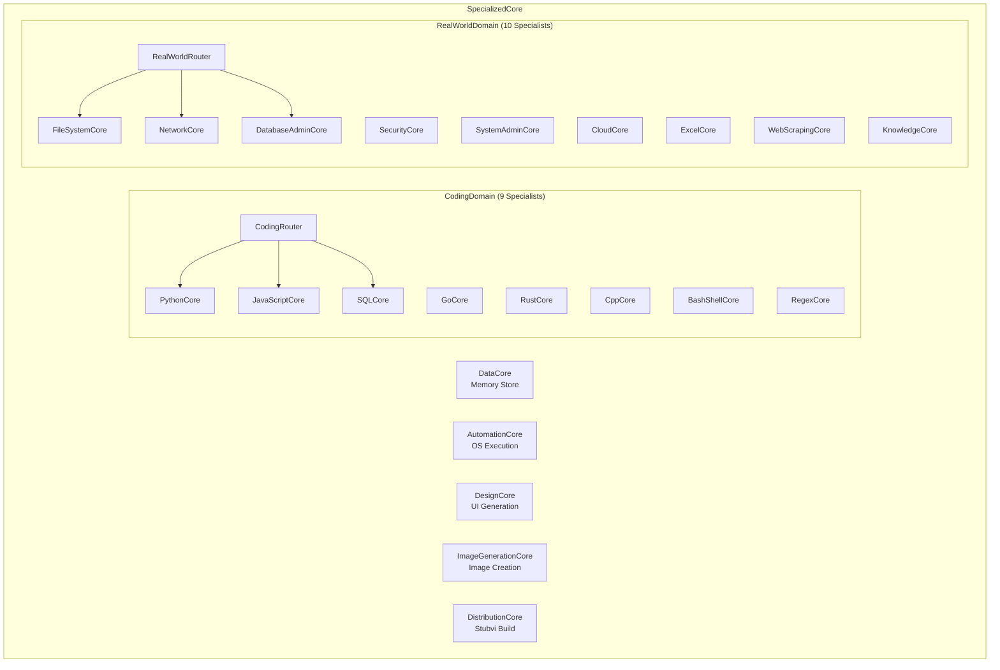

# SpecializedCore — Domain Expert Engines

Domain-specific engines that handle specialized tasks outside the main reasoning loop. Each core owns a specific capability domain.

## Architecture

## Directory Structure

| Directory | Purpose |
|---|---|
| `DataCore/` | Dual memory: ChromaDB (vectors) + SQLite (relational) + GraphRAG |
| `AutomationCore/` | OS command execution, file I/O, process management |
| `DesignCore/` | HTML/CSS template generation, dark-mode glassmorphism |
| `ImageGenerationCore/` | Local image generation pipeline |
| `DistributionCore/` | Stubvi compilation, telemetry, public build packaging |
| `CodingDomain/` | 9 language specialists + router for code tasks |
| `RealWorldDomain/` | 10 real-world specialists + router for system tasks |
| `VoiceCore/` | Voice I/O (wake word, TTS, transcription) — Phase 3 |
