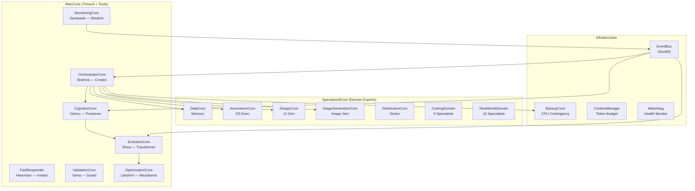
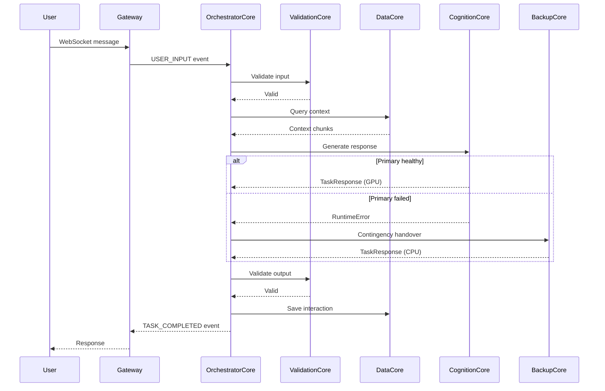

# Backend Core — The Intelligence Engine

The central intelligence layer of Vibhu-Oska AI-OS. All reasoning, memory, routing, and execution logic lives here.

## Architecture

## Directory Structure

| Directory | Purpose |
|---|---|
| `MainCore/` | Trimurti (OrchestratorCore, CognitionCore, EvolutionCore) + supporting tools |
| `SpecializedCore/` | Domain-specific engines (DataCore, AutomationCore, 20 specialists) |
| `BackupCore/` | CPU-based contingency intelligence |
| `EventBus/` | ZeroMQ publish/subscribe inter-core messaging |
| `ContextManager/` | Token budget enforcement for inference |
| `Watchdog/` | Background health monitoring daemon |

## Data Flow

