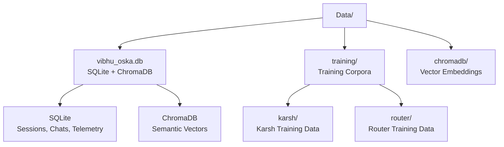
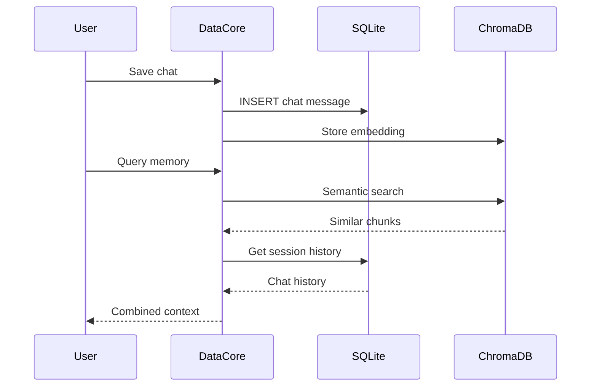

# Data — Persistent Storage

Runtime data, training corpora, and vector embeddings.

## Structure

## Files

| Path | Purpose |
|------|---------|
| `vibhu_oska.db` | Combined SQLite + ChromaDB database |
| `training/karsh/corpus.txt` | Karsh training Q&A pairs |
| `training/router/` | Router training data |
| `chromadb/` | ChromaDB vector store files |

## Data Flow

