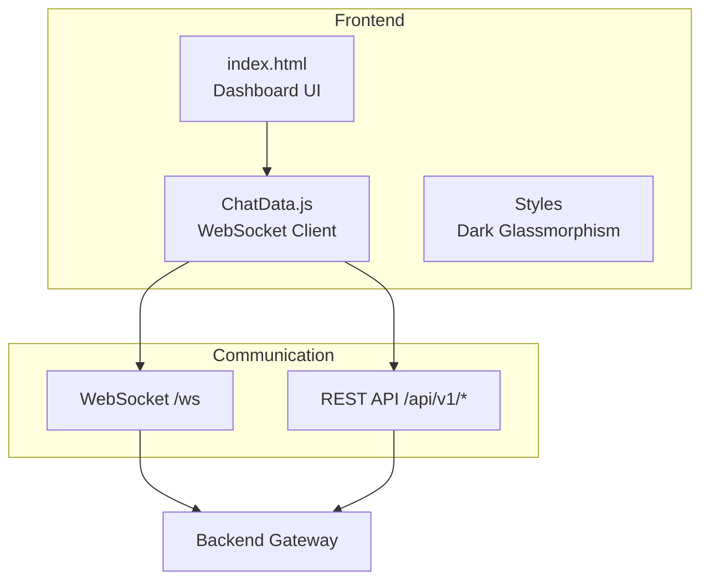
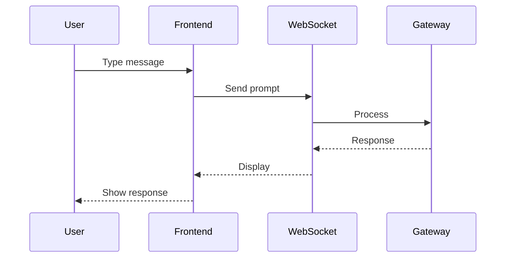

# Frontend — Web Dashboard

Single-page application dashboard for real-time interaction with Vibhu-Oska AI-OS.

## Architecture

## Files

| Directory | Purpose |
|---|---|
| `templates/index.html` | Main dashboard HTML (single page) |
| `static/ChatData.js` | WebSocket client, UI logic, training controls |
| `static/` | CSS, images, static assets |

## Features

- Real-time WebSocket chat
- Training panel (start/monitor Karsh training)
- System monitor (CPU, GPU, RAM, disk)
- Session management
- Dark glassmorphism UI theme

## Communication

