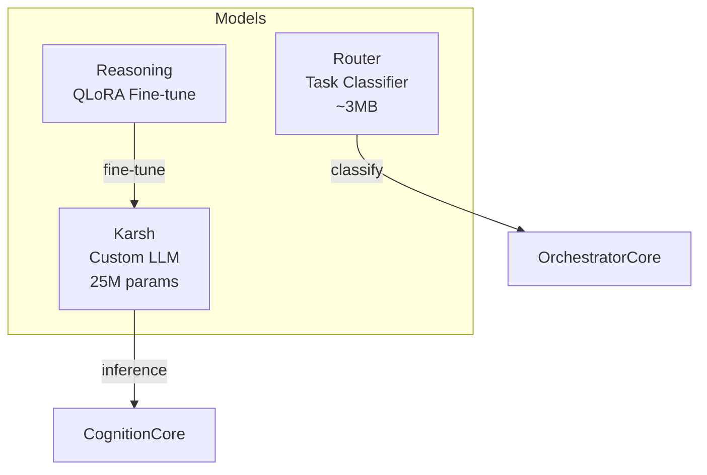

# Vibhu-Oska Models Directory

Neural network architectures, custom tokenizers, training scripts, and model registry for the Vibhu-Oska local intelligence layer.

## Overview

Vibhu-Oska runs self-hosted transformers entirely on local hardware without external API dependencies. The model layer consists of:

1. **Karsh** (`karsh/`): A custom causal language model and BPE tokenizer built from scratch — the primary reasoning engine.
2. **Intent Router** (`router/`): A multi-class classifier that routes prompts to the correct execution target (GPU/CPU) and task category (CHAT/CODE/RESEARCH/MEMORY).

## Architecture



## Karsh (`Models/karsh/`)

The primary in-process reasoning engine.

| Parameter | Value |
|---|---|
| Type | Decoder-only transformer (GPT-style) |
| Attention | Multi-Head Causal Self-Attention |
| Position encoding | RoPE (Rotary Positional Embeddings) |
| Feed-forward | SwiGLU activation (Llama-style) |
| Normalization | RMSNorm (Llama-style) |
| Default config | vocab=8000, hidden=512, 12 layers, 8 heads, max_seq=512 |
| Tokenizer | Custom BPE (KarshBPETokenizer) |

```bash
# Train
python -m Models.karsh.train

# Generate
python -m Models.karsh.generate --prompt "your query"
```

## Router (`Models/router/`)

Speculative task classifier for execution target routing.

```bash
# Generate training data
python -m Models.router.dataset_generator

# Train
python -m Models.router.train --epochs 10
```

## Files

| File | Purpose |
|---|---|
| `registry.json` | Model registry with configs, checkpoints, and status |
| `karsh/` | Karsh LLM: architecture, tokenizer, training, generation |
| `router/` | Intent Router: classification model + training |
| `reasoning/` | QLoRA fine-tuning pipeline |
