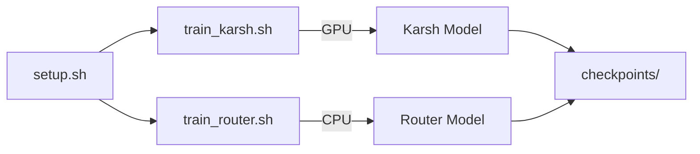

# Scripts — Automation Utilities

Shell scripts for setup, training, code generation, and protobuf compilation.

## Scripts

| Script | Purpose | Usage |
|--------|---------|-------|
| `setup.sh` | Environment setup, dependency install | `bash Scripts/setup.sh` |
| `train_karsh.sh` | Train Karsh LLM model | `bash Scripts/train_karsh.sh` |
| `train_router.sh` | Train router classifier | `bash Scripts/train_router.sh` |
| `generate_code.sh` | Generate boilerplate code | `bash Scripts/generate_code.sh` |
| `generate_protos.sh` | Compile protobuf schemas | `bash Scripts/generate_protos.sh` |

## Training Flow

## Prerequisites

- Python 3.10+
- PyTorch with CUDA
- ZeroMQ
- protobuf compiler (for proto generation)
