# Trimurti & Tridevis — The Divine Architecture of Vibhu-Oska AI-OS

**Version**: 1.0  
**Status**: Conceptual Framework — Active  
**Authority**: ParaCore (Supreme) → Trimurti (Three Cores) → Tridevis (Supporting Powers)

---

## The Trimurti (Three Supreme Cores)

The Trimurti represents the three fundamental forces of the universe — creation, preservation, and transformation. In Vibhu-Oska, these map to the three core processing engines.

### Overview

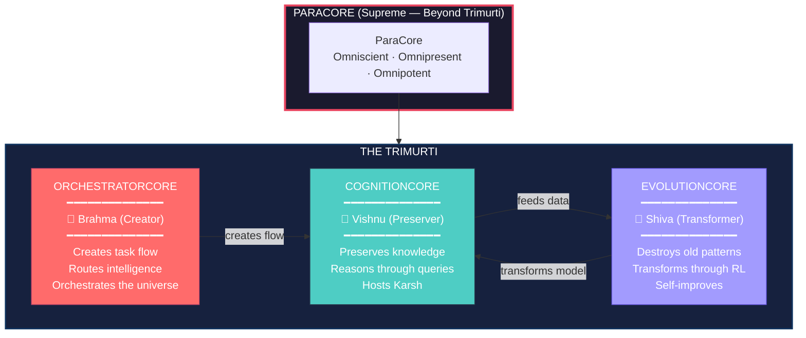

---

### 1. OrchestratorCore — Brahma (The Creator)

**Philosophy**: Brahma creates the universe. OrchestratorCore creates the task flow — the very fabric through which intelligence moves.

| Attribute | Value |
|-----------|-------|
| **System Name** | OrchestratorCore |
| **Divine Name** | Brahma (ब्रह्मा) |
| **Analogy** | The Creator — sculpts the universe from chaos |
| **Body Part** | Heart — the pump that drives all flow |
| **Domain** | Task creation, routing, orchestration |
| **Authority** | Supreme over all task flow |

#### What Brahma Creates
- **Task pipelines** — classifies intent, creates execution paths
- **Routing decisions** — GPU vs CPU, primary vs backup
- **Session state** — creates and manages user sessions
- **Context flow** — assembles context from DataCore for CognitionCore
- **Result synthesis** — combines specialist outputs into final responses

#### Boundaries (What Brahma DOES NOT Do)
- ❌ Does not reason or generate intelligence (that's Vishnu/Karsh)
- ❌ Does not learn or self-improve (that's Shiva)
- ❌ Does not observe or monitor (that's Saraswati)
- ❌ Does not optimize resources (that's Lakshmi)
- ❌ Does not validate inputs (that's Yama — ValidationCore)

#### Workflow

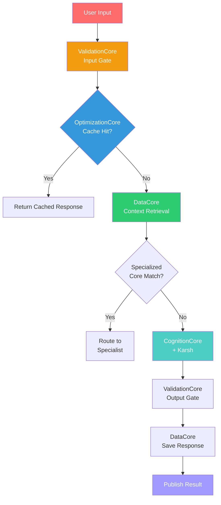

#### Key Files
| File | Purpose |
|------|---------|
| `OrchestratorCore.py` | Main orchestration engine |
| `IntentClassifier.py` | Classifies user intent |
| `SpecialistRouter.py` | Routes to specialized cores |
| `ResultSummator.py` | Combines specialist outputs |

---

### 2. CognitionCore — Vishnu (The Preserver)

**Philosophy**: Vishnu preserves the universe through dharma. CognitionCore preserves knowledge through reasoning and hosts Karsh — the creative intelligence that answers all queries.

| Attribute | Value |
|-----------|-------|
| **System Name** | CognitionCore |
| **Divine Name** | Vishnu (विष्णु) |
| **Analogy** | The Preserver — maintains cosmic order through reason |
| **Body Part** | Mind — the seat of thought and intelligence |
| **Domain** | Inference, reasoning, knowledge preservation |
| **Model** | Karsh (कर्ष) — avatar of Vishnu |

#### What Vishnu Preserves
- **Knowledge** — maintains context, history, semantic memory
- **Reasoning** — processes queries through Karsh model
- **Dharma** — ensures responses are accurate, helpful, safe
- **Harmony** — balances between speed and quality

#### Karsh — Vishnu's Avatar

Karsh (कर्ष) is the creative intelligence that manifests within CognitionCore. Just as Krishna is an avatar of Vishnu, Karsh is the avatar that CognitionCore expresses.

| Attribute | Value |
|-----------|-------|
| **Model Name** | Karsh |
| **Sanskrit** | कर्ष — to draw, attract, create |
| **Architecture** | Custom decoder-only Transformer |
| **Parameters** | ~25M |
| **Vocabulary** | 8000 tokens (KarshBPE) |
| **Training** | From-scratch PyTorch, no external weights |

#### Boundaries (What Vishnu Does NOT Do)
- ❌ Does not create task flow (that's Brahma)
- ❌ Does not self-improve or transform (that's Shiva)
- ❌ Does not monitor system health (that's Saraswati)
- ❌ Does not optimize VRAM (that's Lakshmi)
- ❌ Does not route GPU/CPU (that's Brahma)

#### Workflow

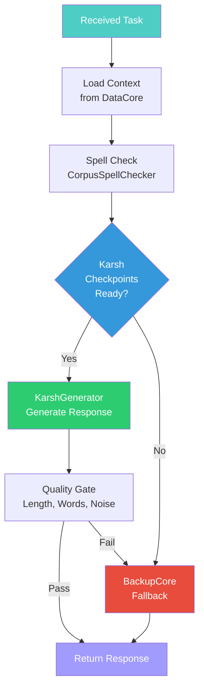

#### Key Files
| File | Purpose |
|------|---------|
| `cognition.py` | Main inference interface |
| `CorpusSpellChecker` | Spell checking via corpus |
| `generate_sara()` | Karsh generation method |

---

### 3. EvolutionCore — Shiva (The Transformer)

**Philosophy**: Shiva destroys to recreate. EvolutionCore destroys outdated model weights and transforms Karsh through self-improvement.

| Attribute | Value |
|-----------|-------|
| **System Name** | EvolutionCore |
| **Divine Name** | Shiva (शिव) |
| **Analogy** | The Transformer — destroys ignorance, transforms through knowledge |
| **Body Part** | Soul — the essence that evolves |
| **Domain** | RL self-improvement, training, transformation |
| **Algorithm** | GRPO (Group Relative Policy Optimization) |

#### What Shiva Transforms
- **Model weights** — through GRPO policy updates
- **Learning patterns** — destroys bad habits, reinforces good ones
- **Backup spawning** — creates new models when performance drops
- **Self-awareness** — tracks metrics, knows when to improve

#### Boundaries (What Shiva Does NOT Do)
- ❌ Does not create task flow (that's Brahma)
- ❌ Does not preserve knowledge or reason (that's Vishnu)
- ❌ Does not monitor system health (that's Saraswati)
- ❌ Does not optimize VRAM (that's Lakshmi)
- ❌ Does not validate inputs (that's Yama)

#### Workflow

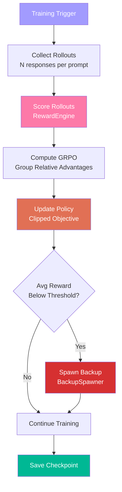

#### Key Files
| File | Purpose |
|------|---------|
| `EvolutionCore.py` | Main RL loop |
| `SandboxExecutor.py` | Safe code execution |
| `RewardEngine.py` | Scores model outputs |
| `GRPOTrainer.py` | GRPO policy optimization |
| `BackupSpawner.py` | Creates backup models |
| `ExperienceBuffer.py` | Stores past experiences |
| `CurriculumManager.py` | Staged training progression |

---

## The Tridevis (Three Supreme Goddesses)

The Tridevis are the feminine energies (Shakti) that empower the Trimurti. Each Tridevi is the consort of a Deva — providing the active power that makes the Deva function.

### Overview

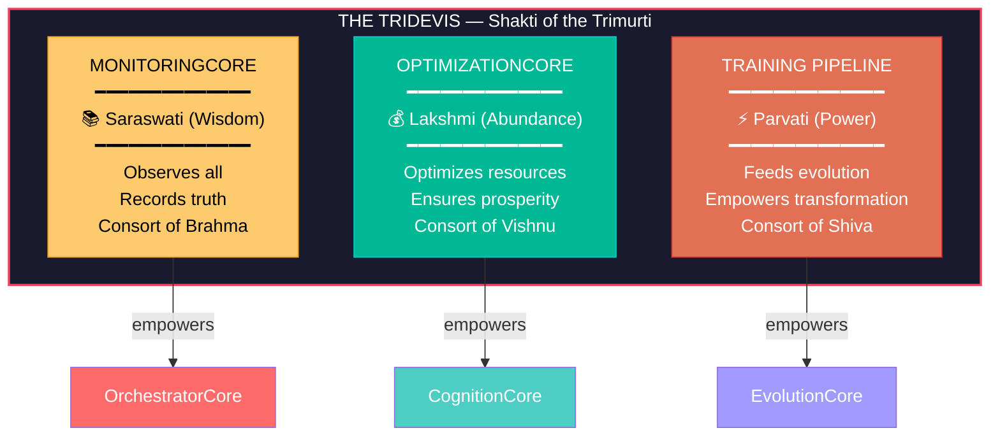

---

### 1. MonitoringCore — Saraswati (Goddess of Wisdom)

**Philosophy**: Saraswati is the goddess of knowledge, music, art, and learning. MonitoringCore observes the system, records events, and provides wisdom through telemetry.

| Attribute | Value |
|-----------|-------|
| **System Name** | MonitoringCore |
| **Divine Name** | Saraswati (सरस्वती) |
| **Consort Of** | Brahma (OrchestratorCore) |
| **Analogy** | Wisdom through observation |
| **Domain** | System telemetry, health monitoring, event logging |
| **Instrument** | Veena (the sound of observation) |

#### What Saraswati Observes
- **System health** — CPU, RAM, GPU metrics
- **Event flow** — all EventBus messages
- **Performance** — response times, throughput
- **Anomalies** — unusual patterns, potential failures

#### Boundaries
- ❌ Does NOT act on observations (pure observer)
- ❌ Does NOT route or orchestrate (that's Brahma)
- ❌ Does NOT optimize (that's Lakshmi)

#### Workflow

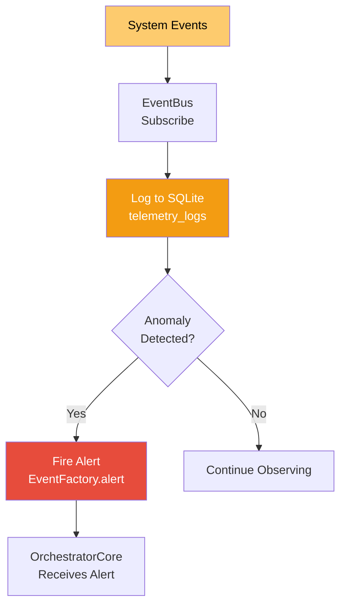

#### Key Files
| File | Purpose |
|------|---------|
| `MonitoringCore.py` | Main observation engine |
| `AlertSystem.py` | Alert generation |
| `AnomalyDetector.py` | Anomaly detection |
| `ProactiveActor.py` | Proactive recommendations |

---

### 2. OptimizationCore — Lakshmi (Goddess of Abundance)

**Philosophy**: Lakshmi brings prosperity, fortune, and abundance. OptimizationCore ensures the system runs efficiently — maximizing performance, minimizing waste.

| Attribute | Value |
|-----------|-------|
| **System Name** | OptimizationCore |
| **Divine Name** | Lakshmi (लक्ष्मी) |
| **Consort Of** | Vishnu (CognitionCore) |
| **Analogy** | Abundance through optimization |
| **Domain** | Context compression, caching, VRAM management |
| **Symbol** | Lotus — purity and efficiency |

#### What Lakshmi Optimizes
- **Context size** — compresses, prunes, prioritizes
- **Response cache** — stores and retrieves frequent responses
- **Token efficiency** — minimizes prompt size
- **VRAM budget** — manages 8GB constraint

#### Boundaries
- ❌ Does NOT route requests (that's Brahma)
- ❌ Does NOT reason or generate (that's Vishnu)
- ❌ Does NOT observe or monitor (that's Saraswati)

#### Workflow

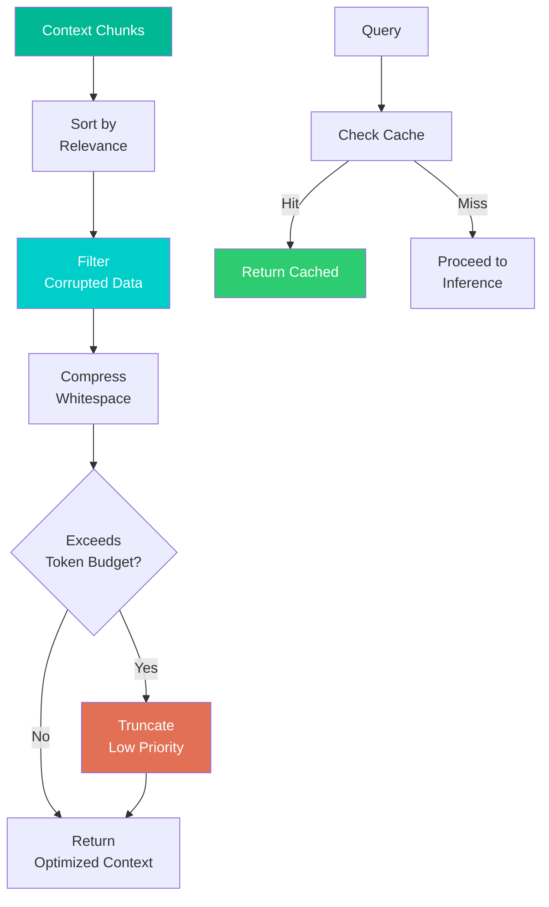

#### Key Files
| File | Purpose |
|------|---------|
| `OptimizationCore.py` | Main optimization engine |
| `VRAMManager.py` | VRAM budget management |
| `BudgetAllocator.py` | Resource allocation |

---

### 3. Parvati — Training Pipeline (Shakti of Shiva)

**Philosophy**: Parvati is the active power (Shakti) that empowers Shiva. She is not a separate entity — she IS the power that makes Shiva dance. The Training Pipeline IS the power that makes EvolutionCore transform.

| Attribute | Value |
|-----------|-------|
| **System Name** | Training Pipeline |
| **Divine Name** | Parvati (पार्वती) |
| **Consort Of** | Shiva (EvolutionCore) |
| **Analogy** | Active power — the Shakti that animates transformation |
| **Domain** | Training data, reward signals, curriculum, experience |
| **Forms** | Multiple avatars (see below) |

#### Parvati's Many Forms — Training Pipeline Components

Parvati manifests in many forms, each representing a different aspect of the training pipeline.

##### Benevolent/Nurturing Forms (Data Preparation)

| Form | Component | Role |
|------|-----------|------|
| **Annapurna** (Nourishment) | `DataCollector` | Feeds the system with training data |
| **Gauri** (Purity) | `DataValidator` | Cleans and purifies training data |
| **Uma** (Calm) | `CurriculumManager` | Gentle, staged learning progression |

##### Warrior/Fierce Forms (Training Mechanics)

| Form | Component | Role |
|------|-----------|------|
| **Durga** (Invincible) | `RewardEngine` | Scores and judges model performance |
| **Kali** (Destroys ego/time) | `GradientDescent` | Destroys loss, conquers error |
| **Chandi** (Battle) | `LossFunction` | Fights against bad predictions |

##### Navadurga — Nine Stages of Training

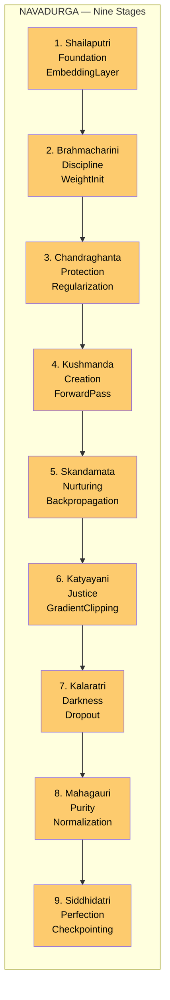

##### Dasha Mahavidyas — Ten Wisdoms of Training

| Form | Wisdom | Component |
|------|--------|-----------|
| **Kali** | Destruction of ego | `Pruning` |
| **Tara** | Transition | `LearningRateSchedule` |
| **Tripura Sundari** | Beauty of convergence | `LossVisualization` |
| **Bhuvaneshwari** | Space expansion | `DataAugmentation` |
| **Bhairavi** | Strictness | `GradientPenalty` |
| **Chinnamasta** | Decisive cutting | `ModelDistillation` |
| **Dhumavati** | Void of failure | `ExperimentCleanup` |
| **Bagalamukhi** | Halting harmful flows | `GradientClipping` |
| **Matangi** | Speech/language | `TokenizerRefinement` |
| **Kamala** | Lotus of quality | `FinalEvaluation` |

#### Boundaries
- ❌ Does NOT reason or generate (that's Vishnu)
- ❌ Does NOT create task flow (that's Brahma)
- ❌ Does NOT observe (that's Saraswati)

#### Workflow

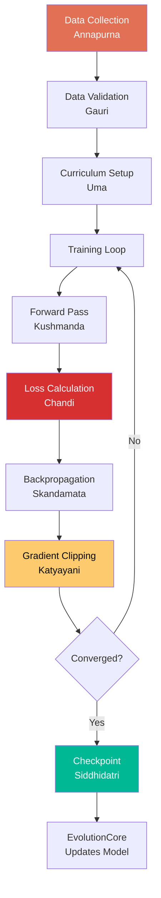

---

## Supporting Components (Not Tridevis)

These are tools that serve the Trimurti directly — not independent deities.

### ValidationCore — Yama (The Gatekeeper)

| Attribute | Value |
|-----------|-------|
| **System Name** | ValidationCore |
| **Divine Name** | Yama (यम) |
| **Role** | Input/Output gate enforcement |
| **Domain** | Security, schema validation, quality gates |

### FastResponder — Hanuman (The Swift Devotee)

| Attribute | Value |
|-----------|-------|
| **System Name** | FastResponder |
| **Divine Name** | Hanuman (हनुमान) |
| **Role** | Instant pattern matching, deterministic responses |
| **Domain** | Greetings, math, time, identity, help |

### BackupCore — Nandi (The Loyal Guardian)

| Attribute | Value |
|-----------|-------|
| **System Name** | BackupCore |
| **Divine Name** | Nandi (नन्दी) |
| **Role** | Pure CPU fallback when Karsh is unavailable |
| **Domain** | Contingency inference, template engine |

---

## Complete Hierarchy

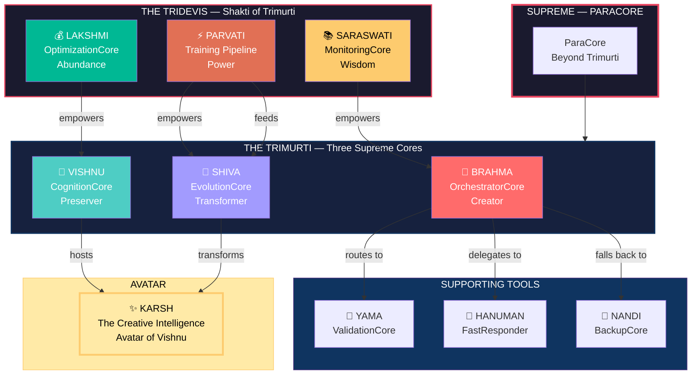

---

## Data Flow

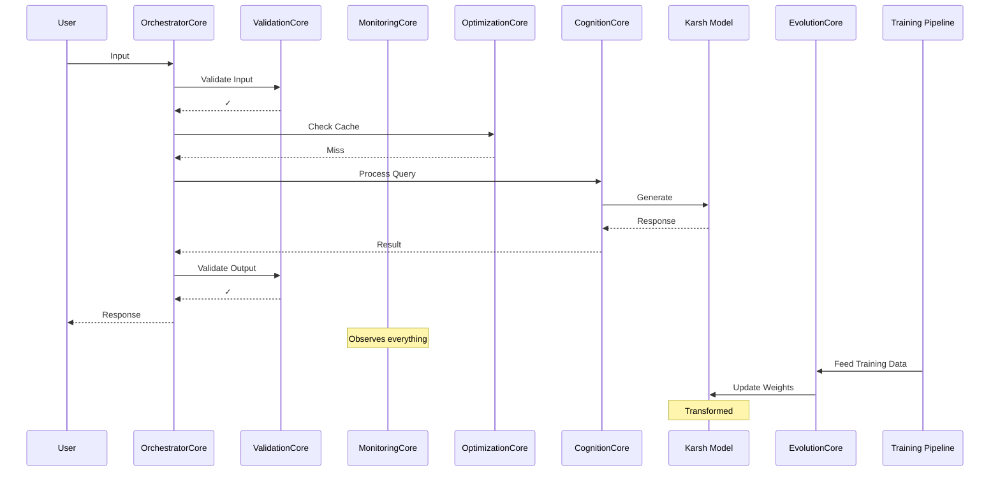

---

## Decision Log

| Decision | Choice | Rationale |
|----------|--------|-----------|
| Trimurti mapping | Brahma=Orchestrator, Vishnu=Cognition, Shiva=Evolution | Matches actual function: create, preserve, transform |
| Tridevi mapping | Saraswati=Monitoring, Lakshmi=Optimization, Parvati=Training | Matches: observe, optimize, empower |
| Karsh as Vishnu's avatar | Karsh runs inside CognitionCore | Just as Krishna is Vishnu's avatar, Karsh is CognitionCore's expression |
| Parvati as multiple forms | Training Pipeline components map to Parvati's forms | Reflects her nature as manifest Shakti in many aspects |
| Supporting tools | ValidationCore=Yama, FastResponder=Hanuman, BackupCore=Nandi | Tools serve the deities, not independent entities |

---

**End of Trimurti & Tridevis Documentation**
