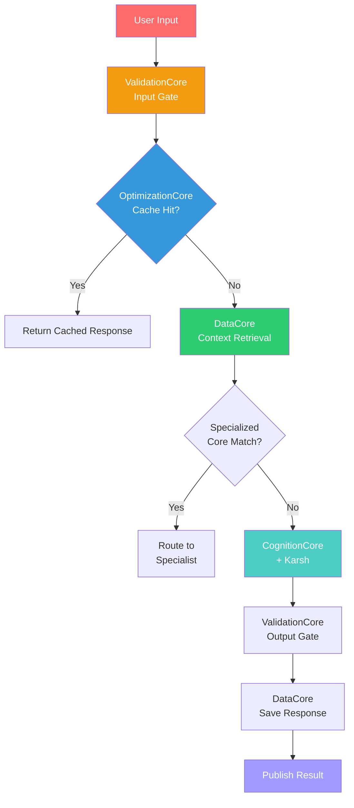

# OrchestratorCore — Brahma (The Creator)

**Divine Name**: Brahma (ब्रह्मा) — The Creator  
**System Name**: OrchestratorCore  
**Body Part**: Heart — the pump that drives all flow  
**Authority**: Supreme over all task flow

---

## Philosophy

Brahma creates the universe. OrchestratorCore creates the **task flow** — the very fabric through which intelligence moves. Every user input flows through Brahma's creation pipeline: validation → context retrieval → routing → execution → validation → response.

Without Brahma, there is no universe. Without OrchestratorCore, there is no task flow.

---

## Responsibilities

### What Brahma Creates
- **Task pipelines** — classifies intent, creates execution paths
- **Routing decisions** — GPU vs CPU, primary vs backup
- **Session state** — creates and manages user sessions
- **Context flow** — assembles context from DataCore for CognitionCore
- **Result synthesis** — combines specialist outputs into final responses

### What Brahma Does NOT Do
- ❌ Does not reason or generate intelligence (that's Vishnu/Karsh)
- ❌ Does not learn or self-improve (that's Shiva)
- ❌ Does not observe or monitor (that's Saraswati)
- ❌ Does not optimize resources (that's Lakshmi)
- ❌ Does not validate inputs directly (that's Yama — ValidationCore)

---

## Workflow

---

## Key Files

| File | Purpose |
|------|---------|
| `OrchestratorCore.py` | Main orchestration engine — subscribes to USER_INPUT, manages full lifecycle |
| `IntentClassifier.py` | Classifies user intent (CHAT, CODE, RESEARCH, MEMORY) |
| `SpecialistRouter.py` | Routes to specialized cores (AutomationCore, DesignCore, ImageGenerationCore) |
| `ResultSummator.py` | Combines specialist outputs into coherent final responses |

---

## Integration Points

| Connected To | Relationship |
|-------------|--------------|
| ValidationCore | Delegates input/output validation |
| OptimizationCore | Delegates cache checks and context optimization |
| DataCore | Delegates session creation, context retrieval, chat saving |
| CognitionCore | Routes inference requests |
| EvolutionCore | Receives transformed models |
| MonitoringCore | Receives health alerts |
| BackupCore | Falls back when CognitionCore fails |
| EventBus | Publishes/subscribes to all task events |

---

## Event Topics

| Topic | Direction | Purpose |
|-------|-----------|---------|
| `USER_INPUT` | Subscribe | Receives user prompts |
| `TASK_CREATED` | Publish | Announces new task |
| `TASK_COMPLETED` | Publish | Sends final response |
| `TASK_FAILED` | Publish | Reports failures |
| `SPECIALIST_REQUEST` | Publish | Routes to specialists |
| `SPECIALIST_RESPONSE` | Subscribe | Receives specialist results |

---

**Boundaries**: Brahma creates flow but does not execute. He orchestrates but does not reason. He is the architect of the pipeline, not the intelligence within it.
