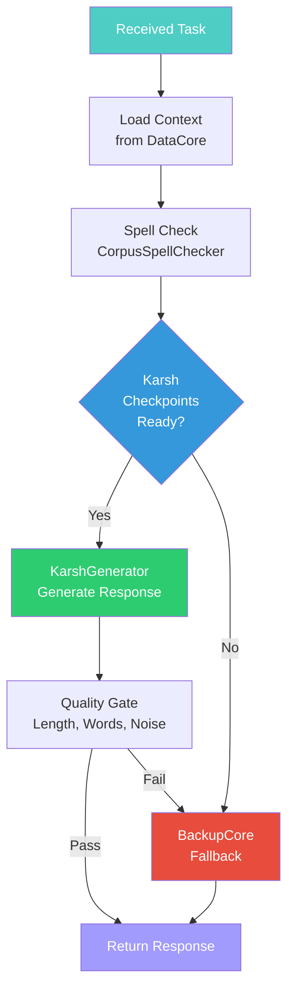

# CognitionCore — Vishnu (The Preserver)

**Divine Name**: Vishnu (विष्णु) — The Preserver  
**System Name**: CognitionCore  
**Body Part**: Mind — the seat of thought and intelligence  
**Domain**: Inference, reasoning, knowledge preservation  
**Avatar**: Karsh (कर्ष) — the creative intelligence

---

## Philosophy

Vishnu preserves the universe through dharma (cosmic order). CognitionCore preserves **knowledge** through reasoning and hosts **Karsh** — the creative intelligence that answers all queries.

Just as Vishnu manifests as Krishna to interact with the world, CognitionCore manifests as Karsh to generate intelligent responses. Karsh IS CognitionCore's expression — the avatar through which Vishnu's preservation becomes tangible.

---

## Responsibilities

### What Vishnu Preserves
- **Knowledge** — maintains context, history, semantic memory
- **Reasoning** — processes queries through Karsh model
- **Dharma** — ensures responses are accurate, helpful, safe
- **Harmony** — balances between speed and quality

### What Vishnu Does NOT Do
- ❌ Does not create task flow (that's Brahma)
- ❌ Does not self-improve or transform (that's Shiva)
- ❌ Does not monitor system health (that's Saraswati)
- ❌ Does not optimize VRAM (that's Lakshmi)

---

## Karsh — Vishnu's Avatar

Karsh (कर्ष) is the creative intelligence that manifests within CognitionCore.

| Attribute | Value |
|-----------|-------|
| **Model Name** | Karsh |
| **Sanskrit** | कर्ष — to draw, attract, create |
| **Architecture** | Custom decoder-only Transformer |
| **Parameters** | ~25M |
| **Layers** | 12 |
| **Attention Heads** | 8 |
| **Hidden Size** | 512 |
| **Vocabulary** | 8000 tokens (KarshBPE) |
| **Training** | From-scratch PyTorch, no external weights |
| **Hardware** | RTX 4060 Laptop GPU (8GB VRAM) |

---

## Workflow

---

## Quality Gate

Before accepting Karsh's output, it must pass:

1. **Minimum length** — ≥50 characters
2. **Real words** — ≥8 words with 4+ characters
3. **No token noise** — ≤3 single capital letters
4. **No junk patterns** — no interleaved number-letter sequences

If any check fails, BackupCore takes over.

---

## Key Files

| File | Purpose |
|------|---------|
| `cognition.py` | Main inference interface — `CognitionCore` class |
| `CorpusSpellChecker` | Spell checking via local corpus |
| `generate_sara()` | Karsh generation method (legacy name, maps to Karsh) |
| `generate_direct()` | Direct transformer inference (future) |

---

## Integration Points

| Connected To | Relationship |
|-------------|--------------|
| OrchestratorCore | Receives inference requests |
| BackupCore | Falls back when Karsh fails |
| HybridCore | Routes between GPU/CPU (being merged into OrchestratorCore) |
| DataCore | Loads context for generation |
| EvolutionCore | Receives model updates from training |
| OptimizationCore | Receives VRAM budget allocation |

---

**Boundaries**: Vishnu preserves but does not create flow. He reasons but does not transform himself. He is the intelligence within the pipeline, not the architect of it.
