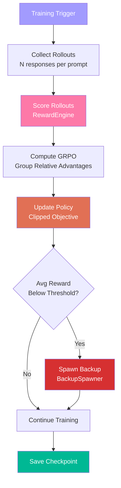

# EvolutionCore — Shiva (The Transformer)

**Divine Name**: Shiva (शिव) — The Transformer  
**System Name**: EvolutionCore  
**Body Part**: Soul — the essence that evolves  
**Domain**: RL self-improvement, training, transformation  
**Algorithm**: GRPO (Group Relative Policy Optimization)

---

## Philosophy

Shiva destroys to recreate. He is the cosmic dancer (Nataraja) who destroys ignorance and transforms the universe through his dance. EvolutionCore **destroys outdated model weights** and **transforms Karsh** through self-improvement.

Without Shiva, the universe stagnates. Without EvolutionCore, Karsh never improves.

---

## Responsibilities

### What Shiva Transforms
- **Model weights** — through GRPO policy updates
- **Learning patterns** — destroys bad habits, reinforces good ones
- **Backup spawning** — creates new models when performance drops
- **Self-awareness** — tracks metrics, knows when to improve

### What Shiva Does NOT Do
- ❌ Does not create task flow (that's Brahma)
- ❌ Does not preserve knowledge or reason (that's Vishnu)
- ❌ Does not monitor system health (that's Saraswati)
- ❌ Does not optimize VRAM (that's Lakshmi)

---

## The RL Loop

---

## GRPO (Group Relative Policy Optimization)

Shiva uses GRPO — a variant of PPO that doesn't require a critic model.

**How it works:**
1. Generate N responses per prompt (rollouts)
2. Score each response with RewardEngine
3. Compute group-relative advantages: `advantage = (reward - mean) / (std + eps)`
4. Update policy with clipped objective: `L = -E[min(ratio * A, clip(ratio) * A)]`

**Why GRPO:**
- No critic network needed (saves VRAM)
- Stable training with group-relative normalization
- Works well on small models (25M params)

---

## Key Files

| File | Purpose |
|------|---------|
| `EvolutionCore.py` | Main RL loop — collect, score, update |
| `SandboxExecutor.py` | Safe code execution for testing |
| `RewardEngine.py` | Scores model outputs |
| `GRPOTrainer.py` | GRPO policy optimization |
| `BackupSpawner.py` | Creates backup models when performance drops |
| `ExperienceBuffer.py` | Stores past experiences for replay |
| `CurriculumManager.py` | Staged training progression |

---

## Integration Points

| Connected To | Relationship |
|-------------|--------------|
| CognitionCore | Transforms Karsh model weights |
| Training Pipeline (Parvati) | Receives training data and reward signals |
| DataCore | Stores experiences and checkpoints |
| MonitoringCore | Reports training metrics |
| BackupCore | Spawns backups when performance drops |

---

**Boundaries**: Shiva transforms but does not create flow. He destroys to recreate but does not preserve. He is the engine of change, not the architect of the pipeline.
