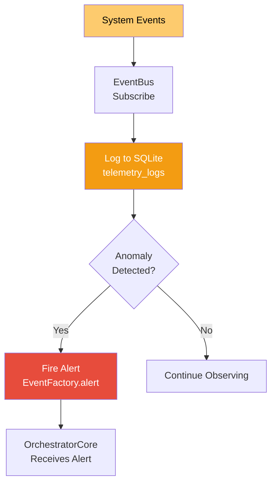

# MonitoringCore — Saraswati (Goddess of Wisdom)

**Divine Name**: Saraswati (सरस्वती) — Goddess of Wisdom  
**System Name**: MonitoringCore  
**Consort Of**: Brahma (OrchestratorCore)  
**Domain**: System telemetry, health monitoring, event logging  
**Instrument**: Veena (the sound of observation)

---

## Philosophy

Saraswati is the goddess of knowledge, music, art, and learning. She sits beside Brahma, observing creation and recording truth. MonitoringCore **observes** the system, **records** events, and provides **wisdom** through telemetry.

She does not act — she watches. She does not intervene — she records. Her wisdom comes from pure observation.

---

## Responsibilities

### What Saraswati Observes
- **System health** — CPU, RAM, GPU metrics
- **Event flow** — all EventBus messages
- **Performance** — response times, throughput
- **Anomalies** — unusual patterns, potential failures

### What Saraswati Does NOT Do
- ❌ Does NOT act on observations (pure observer)
- ❌ Does NOT route or orchestrate (that's Brahma)
- ❌ Does NOT optimize (that's Lakshmi)

---

## Workflow

---

## Key Files

| File | Purpose |
|------|---------|
| `MonitoringCore.py` | Main observation engine — subscribes to system topics |
| `AlertSystem.py` | Alert generation and routing |
| `AnomalyDetector.py` | Anomaly detection in metrics |
| `ProactiveActor.py` | Proactive recommendations based on observations |

---

## Event Topics

| Topic | Direction | Purpose |
|-------|-----------|---------|
| `SYSTEM_HEALTH` | Subscribe | Receives health check events |
| `SYSTEM_ALERT` | Subscribe | Receives system alerts |
| `SYSTEM_ALERT` | Publish | Fires alerts when anomalies detected |

---

**Boundaries**: Saraswati observes but does not act. She records but does not decide. She is the mirror that reflects truth, not the hand that shapes reality.
