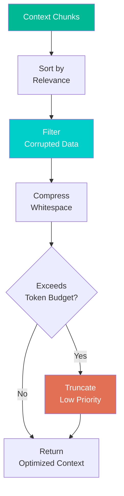
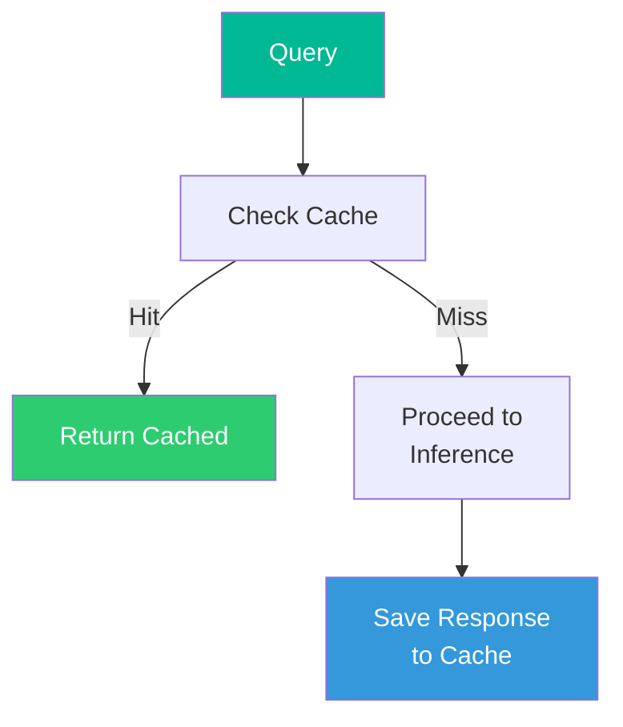

# OptimizationCore — Lakshmi (Goddess of Abundance)

**Divine Name**: Lakshmi (लक्ष्मी) — Goddess of Abundance  
**System Name**: OptimizationCore  
**Consort Of**: Vishnu (CognitionCore)  
**Domain**: Context compression, caching, VRAM management  
**Symbol**: Lotus — purity and efficiency

---

## Philosophy

Lakshmi brings prosperity, fortune, and abundance. She ensures there is always enough — never wasteful, never lacking. OptimizationCore ensures the system runs **efficiently** — maximizing performance, minimizing waste.

She compresses context to fit token budgets. She caches responses to avoid redundant work. She manages VRAM to ensure the 8GB budget is never exceeded.

---

## Responsibilities

### What Lakshmi Optimizes
- **Context size** — compresses, prunes, prioritizes
- **Response cache** — stores and retrieves frequent responses
- **Token efficiency** — minimizes prompt size
- **VRAM budget** — manages 8GB constraint

### What Lakshmi Does NOT Do
- ❌ Does NOT route requests (that's Brahma)
- ❌ Does NOT reason or generate (that's Vishnu)
- ❌ Does NOT observe or monitor (that's Saraswati)

---

## Workflow

### Context Optimization

### Cache Management

---

## Key Files

| File | Purpose |
|------|---------|
| `OptimizationCore.py` | Main optimization engine |
| `VRAMManager.py` | VRAM budget management |
| `BudgetAllocator.py` | Resource allocation across cores |

---

**Boundaries**: Lakshmi optimizes but does not create. She preserves abundance but does not reason. She is the efficiency within the system, not the intelligence.
