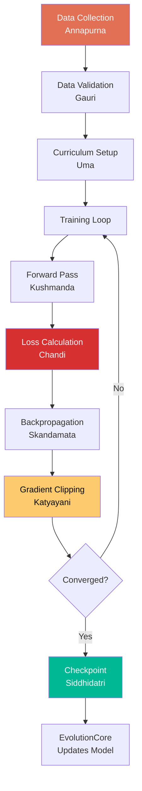

# Training Pipeline — Parvati (Shakti of Shiva)

**Divine Name**: Parvati (पार्वती) — The Active Power  
**System Name**: Training Pipeline  
**Consort Of**: Shiva (EvolutionCore)  
**Domain**: Training data, reward signals, curriculum, experience  
**Forms**: Multiple avatars (see below)

---

## Philosophy

Parvati is the active power (Shakti) that empowers Shiva. She is not a separate entity — she IS the power that makes Shiva dance. The Training Pipeline IS the power that makes EvolutionCore transform.

Without Parvati, Shiva has no power. Without the Training Pipeline, EvolutionCore has no data to learn from.

---

## Parvati's Many Forms

Parvati manifests in many forms, each representing a different aspect of the training pipeline.

### Benevolent/Nurturing Forms (Data Preparation)

| Form | Component | Role |
|------|-----------|------|
| **Annapurna** (Nourishment) | `DataCollector` | Feeds the system with training data |
| **Gauri** (Purity) | `DataValidator` | Cleans and purifies training data |
| **Uma** (Calm) | `CurriculumManager` | Gentle, staged learning progression |

### Warrior/Fierce Forms (Training Mechanics)

| Form | Component | Role |
|------|-----------|------|
| **Durga** (Invincible) | `RewardEngine` | Scores and judges model performance |
| **Kali** (Destroys ego/time) | `GradientDescent` | Destroys loss, conquers error |
| **Chandi** (Battle) | `LossFunction` | Fights against bad predictions |

### Navadurga — Nine Stages of Training

| Form | Stage | Component |
|------|-------|-----------|
| Shailaputri | Foundation | `EmbeddingLayer` |
| Brahmacharini | Discipline | `WeightInit` |
| Chandraghanta | Protection | `Regularization` |
| Kushmanda | Creation | `ForwardPass` |
| Skandamata | Nurturing | `Backpropagation` |
| Katyayani | Justice | `GradientClipping` |
| Kalaratri | Darkness | `Dropout` |
| Mahagauri | Purity | `Normalization` |
| Siddhidatri | Perfection | `Checkpointing` |

### Dasha Mahavidyas — Ten Wisdoms of Training

| Form | Wisdom | Component |
|------|--------|-----------|
| Kali | Destruction of ego | `Pruning` |
| Tara | Transition | `LearningRateSchedule` |
| Tripura Sundari | Beauty of convergence | `LossVisualization` |
| Bhuvaneshwari | Space expansion | `DataAugmentation` |
| Bhairavi | Strictness | `GradientPenalty` |
| Chinnamasta | Decisive cutting | `ModelDistillation` |
| Dhumavati | Void of failure | `ExperimentCleanup` |
| Bagalamukhi | Halting harmful flows | `GradientClipping` |
| Matangi | Speech/language | `TokenizerRefinement` |
| Kamala | Lotus of quality | `FinalEvaluation` |

---

## Workflow

---

## Key Components

| Component | Parvati Form | Purpose |
|-----------|-------------|---------|
| `DataCollector` | Annapurna | Gathers training data from corpus |
| `DataValidator` | Gauri | Validates data quality |
| `CurriculumManager` | Uma | Manages training stages |
| `RewardEngine` | Durga | Scores model outputs |
| `ExperienceBuffer` | Skandamata | Stores past experiences |

---

**Boundaries**: Parvati empowers but does not reason. She provides power but does not direct it. She is the energy that drives transformation, not the intelligence that guides it.
