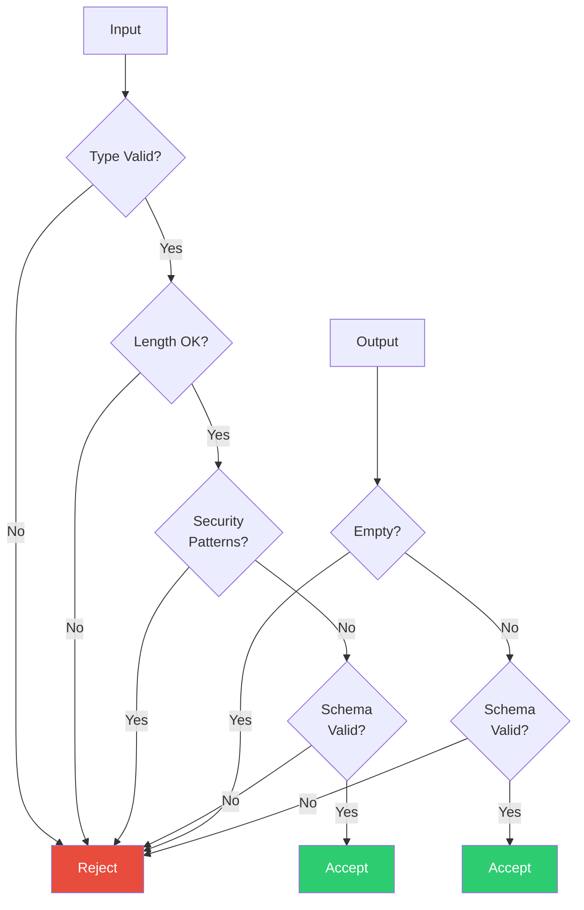

# ValidationCore — Yama (The Gatekeeper)

**Divine Name**: Yama (यम) — The Gatekeeper  
**System Name**: ValidationCore  
**Role**: Input/Output gate enforcement  
**Domain**: Security, schema validation, quality gates

---

## Philosophy

Yama is the lord of death and justice. He guards the gates between worlds, ensuring only the worthy pass. ValidationCore guards the gates of the system, ensuring only valid inputs enter and only safe outputs leave.

---

## Responsibilities

### Entry Gate (Input Validation)
- **Type checking** — ensures input is dict or TaskRequest
- **Length checking** — rejects prompts >100,000 characters
- **Security patterns** — blocks SQL injection, XSS, command injection
- **Schema validation** — ensures Pydantic model compliance

### Exit Gate (Output Validation)
- **Existence check** — ensures response is not empty
- **Schema check** — ensures TaskResponse compliance
- **Content check** — ensures response has actual content

---

## Workflow

---

## Key Files

| File | Purpose |
|------|---------|
| `validation.py` | Main validation engine |

---

**Boundaries**: Yama guards but does not create. He enforces rules but does not make them. He is the judge, not the king.
