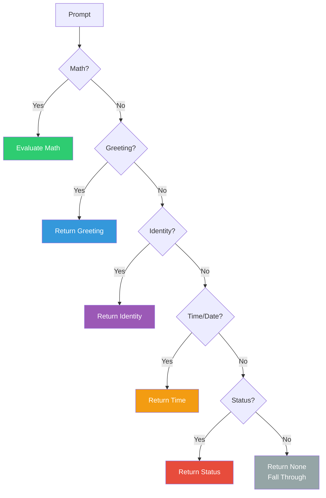

# FastResponder — Hanuman (The Swift Devotee)

**Divine Name**: Hanuman (हनुमान) — The Swift Devotee  
**System Name**: FastResponder  
**Role**: Instant pattern matching, deterministic responses  
**Domain**: Greetings, math, time, identity, help

---

## Philosophy

Hanuman is the devoted servant of Rama, known for his incredible speed and unwavering devotion. FastResponder is the devoted servant of the system, known for its incredible speed in handling simple patterns.

When a user says "hello" or asks "what time is it", there's no need for full inference. FastResponder handles these instantly — like Hanuman leaping across the ocean.

---

## Responsibilities

### Instant Patterns
- **Greetings** — hello, hi, hey, good morning/afternoon/evening
- **Identity** — who are you, what is vibhu-oska
- **Status** — system status, health check
- **Telemetry** — CPU, GPU, RAM usage
- **Time/Date** — current time, date
- **OS Info** — platform, machine info
- **Help** — command reference
- **Math** — arithmetic expressions, sqrt, factorial
- **Acknowledgements** — ok, thanks, got it

---

## Workflow

---

## Key Files

| File | Purpose |
|------|---------|
| `FastResponder.py` | Main instant response engine |
| `ResponseCache.py` | Caches frequent responses |

---

**Boundaries**: Hanuman serves but does not lead. He is fast but not wise. He handles the simple so that others can handle the complex.
