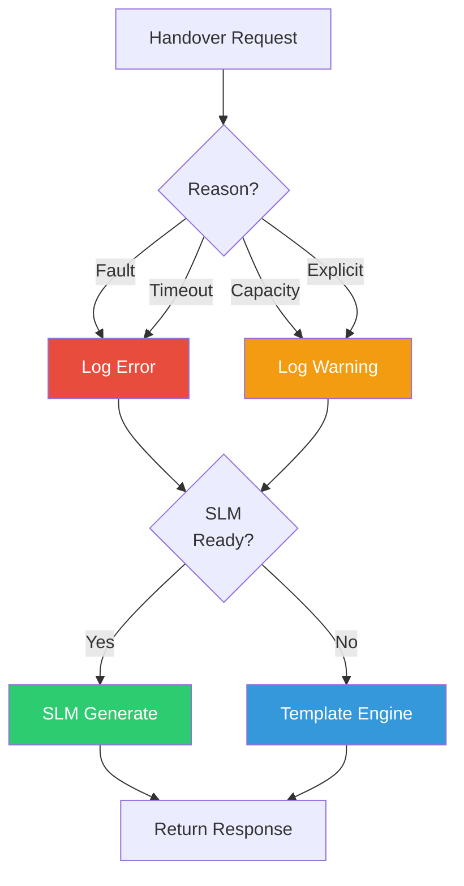

# BackupCore — Nandi (The Loyal Guardian)

**Divine Name**: Nandi (नन्दी) — The Loyal Guardian  
**System Name**: BackupCore  
**Role**: Pure CPU fallback when Karsh is unavailable  
**Domain**: Contingency inference, template engine

---

## Philosophy

Nandi is the faithful vehicle of Shiva, always ready to serve. BackupCore is the faithful fallback of the system, always ready to serve when Karsh is unavailable.

Nandi does not replace Shiva — he waits patiently until Shiva returns. BackupCore does not replace Karsh — it provides intelligent responses until Karsh is ready.

---

## Responsibilities

### When BackupCore Activates
- **Primary fault** — CognitionCore throws an exception
- **Primary timeout** — CognitionCore takes too long (>60s)
- **Primary at capacity** — too many concurrent requests
- **Explicit request** — user forces backup mode

### What BackupCore Provides
- **Local SLM** — small language model if available
- **Template Engine** — context-aware templated responses
- **FastResponder delegation** — instant patterns
- **Autonomous learning** — background data acquisition

---

## Workflow

---

## Key Files

| File | Purpose |
|------|---------|
| `BackupCore.py` | Main fallback engine |
| `BilingualCore.py` | Hindi/English bilingual support |
| `LocalSLM` | Small language model loader |
| `ContextAwareTemplateEngine` | Template-based response generation |

---

**Boundaries**: Nandi waits but does not lead. He serves but does not decide. He is the safety net, not the tightrope walker.
