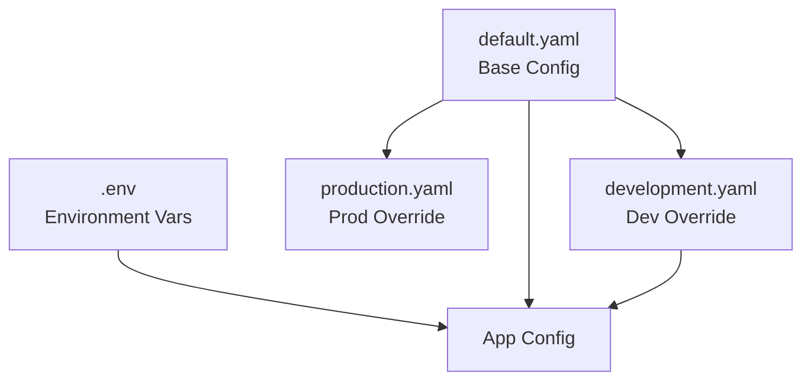

# Configuration

YAML configuration files for Vibhu-Oska AI-OS.

## Files

| File | Purpose |
|------|---------|
| `default.yaml` | Base configuration (ports, timeouts, feature flags) |
| `development.yaml` | Development overrides (debug mode, verbose logging) |

## Configuration Hierarchy

## Key Settings

| Setting | Default | Description |
|---------|---------|-------------|
| `server.port` | 8100 | Gateway HTTP port |
| `server.ws_port` | 8101 | WebSocket port |
| `model.device` | auto | GPU/CPU selection |
| `model.max_seq_len` | 512 | Max sequence length |
| `memory.chroma_path` | `Data/chromadb/` | Vector store path |
| `memory.db_path` | `Data/vibhu_oska.db` | SQLite path |
| `training.epochs` | 60 | Training epochs |
| `training.batch_size` | 8 | Training batch size |
